# Gallery

The figures a physics or chemistry paper keeps redrawing, each built from code by
one script in `examples/` and shown here as the SVG it writes. Every one
is a few dozen lines of geometry: no layer is assigned per object, no occlusion
is worked out by hand, and every element keeps the id it was given, so the file
opens in Inkscape as named objects. Mathematical labels are typeset by TeX
through [VecTeX](https://github.com/maiani/vectex) and held upright at their
points by [slots](scenes.md#anchoring-upright-content).

Build them all, with timings, from a checkout:

```bash
uv run python examples          # SVG and PNG to examples/out
uv run python examples --docs   # and refresh the SVGs on this page
```

Each script also runs on its own, `uv run python examples/perovskite.py`.

## Crystal structure

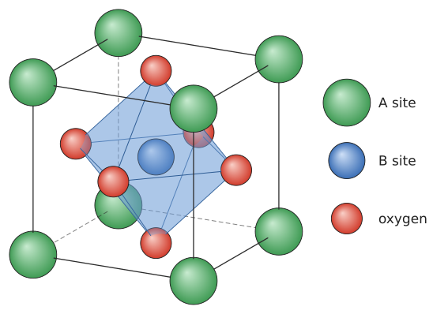

A cubic perovskite ABO₃ cell: A cations on the corners, the B cation inside a
translucent BO₆ octahedron, and the cell edges dashed where the cell hides them.
Atoms, edges, and octahedron faces share one
[depth-sorted layer](scenes.md#sorting-by-depth), so each face of the
octahedron is clipped exactly where an oxygen in front hides it. The octahedron
comes from its six corners alone through
[`convex_polyhedron`](shapes.md#polyhedra), drawn as stroked faces so its edges
are clipped with them, and the cell edges stop at the atom surfaces with
`edges(trim=...)`, so their dashed hidden parts never cross an atom.

`examples/perovskite.py`

## Brillouin zone

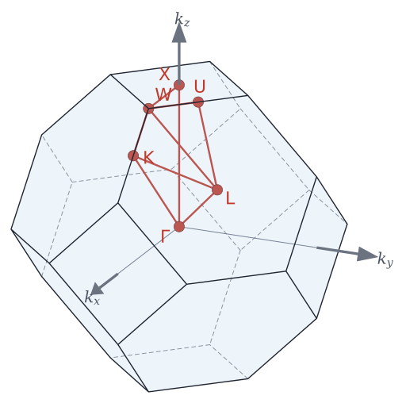

The truncated octahedron of the fcc lattice, from its 24 corners: coplanar
triangles merge into eight hexagons and six squares. Hidden edges are dashed and
sit under the translucent faces, and the high-symmetry path Γ–X–W–K–Γ–L–U–W–L–K
runs inside. The labels are typeset by TeX through
[VecTeX](https://github.com/maiani/vectex) and held upright by
[slots](scenes.md#anchoring-upright-content).

`examples/brillouin_zone.py`

## Molecule

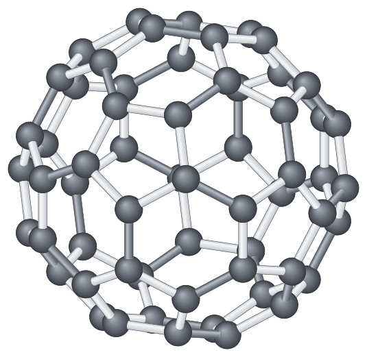

Buckminsterfullerene: sixty atoms and ninety bonds, sorted together by depth.
Each bond is a [`cylinder`](scenes.md#curved-solids) cut back to the two atom
surfaces, and the thirty double bonds are drawn darker. Spheres and cylinders
are exact outlines — a `<circle>` per atom, and two lines and two elliptical
arcs per bond — so the file is small and each atom is one circle in an editor.

`examples/fullerene.py`

## Bloch sphere

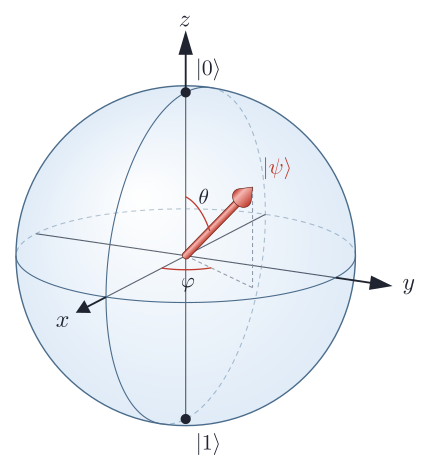

A qubit state at polar angle θ and azimuth φ. The equator and the two meridians,
one great circle in each coordinate plane so that every axis meets the sphere
where two of them cross, are
[split exactly where they pass behind the sphere](scenes.md#hidden-lines) and
dashed there; the state is a solid [`arrow3d`](scenes.md#curved-solids), and the
angles are [`arc_shape`](shapes.md#arcs-and-helices) arcs in their own planes.

`examples/bloch_sphere.py`

## Band structure

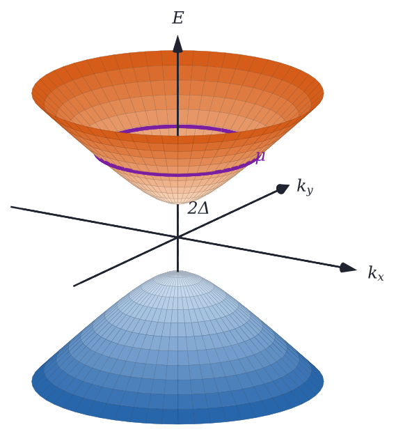

A gapped Dirac cone, E = ±√(k² + Δ²), with a chemical potential cutting the upper
band. Both bands are meshes from [`surface_faces`](shapes.md#surfaces), coloured
by energy, sorted together with the axes and the Fermi circle, which are thin
[tubes](scenes.md#curved-solids). The energy axis passes behind the front wall of
the upper band and shows again inside it, with no layer assigned by hand.

`examples/dirac_cone.py`

## Spin texture

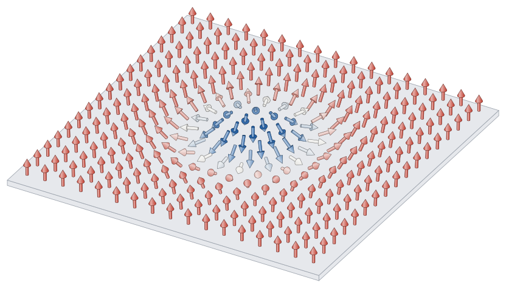

A Néel skyrmion: 289 solid spins on a square lattice, coloured by their
out-of-plane component, on a thin film. Every spin is one `<g>` named after its
lattice site, and the depth sort handles every overlap at any viewing angle.

`examples/skyrmion.py`

## Coil

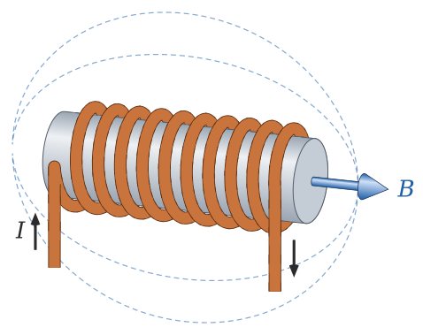

A copper coil wound on a core. The coil is one tube along a
[`helix`](shapes.md#arcs-and-helices), sharing a
[depth-sorted layer](scenes.md#sorting-by-depth) with the core, so each turn
passes behind the core and comes round in front of it again.

`examples/solenoid.py`

## Nanowire device

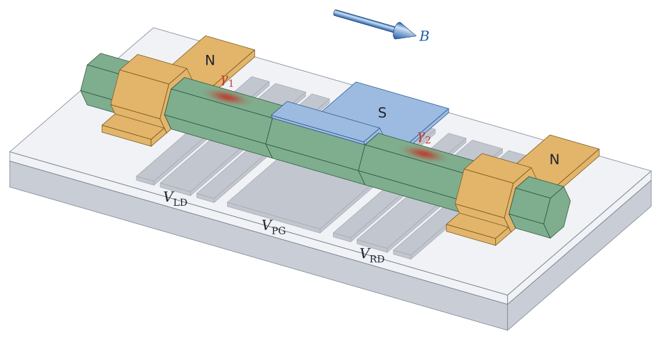

A minimal Kitaev chain, after Dvir et al., Nature 614, 445 (2023): an InSb
nanowire on seven bottom finger gates, two quantum dots coupled through a
grounded Al shell, Cr/Au contacts draped across the wire, and a pair of
Majorana modes, one on each dot. The wire and every film are cross-sections
[extruded](shapes.md#extrusions) along `x`: the Al is a shell on the three facets that face its evaporation
source plus a slab on the dielectric, and each contact a shell over the wire
plus a pad on either side. They share a
[depth-sorted layer](scenes.md#sorting-by-depth), since which contact hides
which part of the wire depends on the side the camera is on; the wire's facets
under a film are left out, so no two faces lie flush against each other. Every kind of
object carries a [class](scenes.md#classes) — `.gate`, `.plunger`,
`.superconductor`, `.lead` — so all the gates select together in an editor.

`examples/kitaev_chain.py`

## Mirror planes

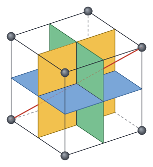

The three mirror planes of a cubic cell, crossing at its centre. Each plane is
partly in front of and partly behind each of the others — a cycle that no order of
drawing whole planes gets right. In a
[depth-sorted layer](scenes.md#sorting-by-depth) each plane is clipped to what shows
of it, the body diagonal is dashed exactly where a plane hides it, and the cell's
dashed back edges disappear where the planes cover them.

`examples/mirror_planes.py`

## Devices

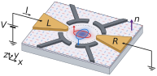

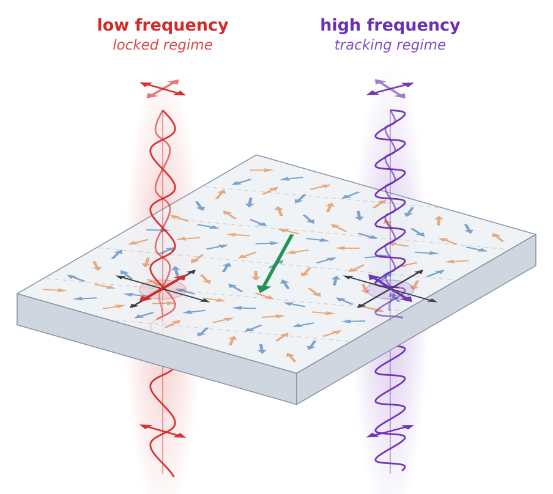

The two worked examples one level up, `examples/altermagnetic_dot.py` and
`examples/slab_polarizer.py`, at their default projections. They predate the
curved solids and the depth sort, and are layered by hand: the right tool for a
handful of large, flat parts with a beam through them.
